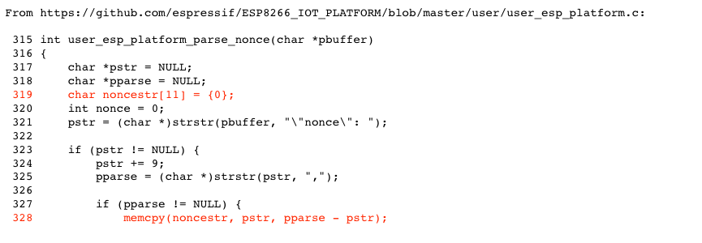
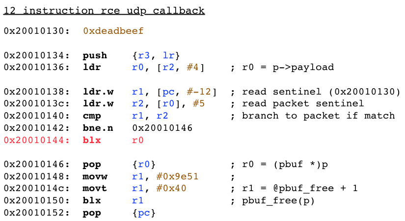

# Exploiting Memory Corruption Vulnerabilities on the FreeRTOS Operating System

# Abstract

The platforms powering the growth of the Internet-of-Things include tried-and-true embedded Real-Time Operating Systems (RTOSes). These lean OSes are designed for performance and reliability, but they force application developers to use C and often lack the exploit mitigations implemented in consumer OSes. This unforgiving environment places the burden of security entirely on the programmer and makes the risk of memory corruption vulnerabilities on these increasingly ubiquitous systems very real.

This research studied the impact of memory corruption vulnerabilities in the context of the FreeRTOS operating system when used with the lwIP embedded TCP/IP stack.  End-to-end exploitation of a stack overflow vulnerability was demonstrated to underscore the security risk in this context.  FreeRTOS was chosen as a focus because of its popularity among device manufacturers and developers.

# Research objectives

The goals of this research were twofold:

1. Understand the impact of memory corruption vulnerabilities in the context of FreeRTOS and lwIP
2. Raise awareness about the risks of memory corruption vulnerabilities on embedded systems by demonstrating the consequences in a realistic way

To achieve these objectives, FreeRTOS, lwIP, vendor SDKs, and popular software used with this platform was audited and fuzzed to identify potential security issues.   Once vulnerabilities were identified, proof-of-concepts were developed to study the challenges of exploitation in this context.

This research was not meant to portray FreeRTOS as flawed.  FreeRTOS, like many embedded operating systems, wasn't designed to protect against these kinds of vulnerabilities.  The findings of this research did not contradict any claims about the security of FreeRTOS.

# Identifying and reporting vulnerabilities

Code review was the primary means of identifying vulnerabilities as part of this research.  Source code for FreeRTOS, lwIP, and contributed servers and applications was freely available on sites like [GitHub](http://github.com).  No vulnerabilities were identified in the FreeRTOS and lwIP codebases themselves.  However, numerous bugs affecting applications built for FreeRTOS were found during audits.

Fuzzing (using _afl_) was also performed to identify vulnerabilities.  lwIP as well as several file-format parsing libraries were fuzzed using AFL on emulated and physical ARM systems.

The following vulnerability in Espressif's IOT Platform (based on FreeRTOS) was reported and quickly fixed.  These and other high impact bugs that were identified were troublingly "shallow" and easy to spot during review.

# Exploiting a stack overflow in a lwIP callback

## Code-execution 

The FreeRTOS scheduler deals with processes called "tasks", and systems typically have at least half a dozen tasks to support network access and system services.  Tasks have a dedicated region of memory allocated in the system heap for use as a stack, and the FreeRTOS scheduler will continue to schedule a task even when it is executing maliciously introduced code.  This ensures that the target task will continue to function as it executes shellcode without additional measures (like masking interrupts) that might be required on simpler embedded systems.

The position of the payload on the stack is often predictable.  On architectures that support it, the payload can be executed directly on the stack.  To make the exploit more general and avoid cache-incoherence issues Return-Oriented Programming (ROP) should be used.  Even in a small system image (<10k) thumb gadgets for performing full exploitation via ROP were available.

## Cleanup

FreeRTOS tasks perform essential system functions, and the target task should continue to function after exploitation.  For example, in the case of a vulnerability in a registered lwIP callback (commonly used to implement server tasks), the vulnerability may affect the lwIP TCP/IP thread itself: if the target task stops functioning, the system will become inaccessible.

Keeping a task alive post-exploitation can be done in a bug-specific way by first finding acceptable values for any preserved registers that were overwritten, unrolling the stack, and then returning to a "safe" location in the target task.  However, FreeRTOS code often uses statically-allocated global variables for key data structures, rather than variables that are allocated on the heap or stack.  This facilitates a simpler approach to cleanup after exploitation: call the task entry point to effectively "restart" the exploited task with no interruption to system operation or stability.  This may leak some memory in the form of packet data that is not freed, and memory allocated by parent functions in the call chain, but it is simpler compared to the former approach.  For the example of a vulnerability in a lwIP callback function, restarting the target task is as simple as returning to tcpip_thread(): this task entry point uses a static "mbox" data structure and continues to function.

# Achieving persistence on an ARM target system

During the ShmooCon presentation, one approach that bootstrapped full RCE using a small inbound "stager" shellcode was presented.  The steps taken were:

1. A stack-overflow vulnerability was exploited to execute this "staging" payload.
2. A second-stage callback payload was written to an unused area of memory by the stager.  This payload could be written past the system stack boundary, in the system heap, in lwIPs own heap, or in any unused area of memory.
3. Facilities in lwIP were used to wire this second-stage callback into the operating system to cause it to run in response to inbound network packets.
4. The second-stage callback listened for inbound network packets, and executed them.

The following lwIP udp callback that bootstrapped full code execution in 12 instructions was presented:

# Conclusions

The IoT is still in its infancy, and is attracting a new generation of developers that may be unaccustomed to dealing with the perils of development in C.  This research demonstrated the threat posed by memory corruption vulnerabilities in this context.  As security professionals it is important that we begin auditing this technology before these systems reach ubiquity.  There is an opportunity for vendors to provide embedded systems with additional security hardening measures.  FreeRTOS in particular could incorporate stack canaries, heap hardening integrity checks, and more widespread use of the MPU to enforce XN permissions and prevent unrestricted access to system memory.

FreeRTOS is just one operating system among at least half a dozen, and there are lots of network servers, embedded networking stacks, and other software that will benefit from review.  Attendees of this talk were strongly encouraged to participate in the review process and report bugs responsibly to improve the security of these systems.

# References

[^1] Fx and Ftr (DefCon presentation, 2002). Attacking Networked Embedded Systems.  http://www.phenoelit.org/stuff/defconX.pdf
[^2] Jack, Barnaby (Whitepaper, 2007).  Vector Rewrite Attack: Exploitable NULL Pointer Vulnerabilities on ARM and XScale Architectures.  https://cansecwest.com/slides07/Vector-Rewrite-Attack.pdf 
[^3] Heffner, C. (Blog post, 2014).  WRT120N fprintf Stack Overflow.  http://www.devttys0.com/2014/02/wrt120n-fprintf-stack-overflow/
[^4] Formaggio, Y., Hsu, R., and Liu, E. (44Con presentation, 2015). Attacking VxWorks: from Stone Age to Interstellar.  http://www.slideshare.net/44Con/44con-london-attacking-vxworks-from-stone-age-to-interstellar

#### Metadata

Tags: FreeRTOS, real-time operating system, embedded, IoT, exploitation, memory corruption

**Primary Author Name**: Joel Sandin
**Primary Author Affiliation**: Independent Security Researcher
**Primary Author Email**: jsandin@gmail.com

