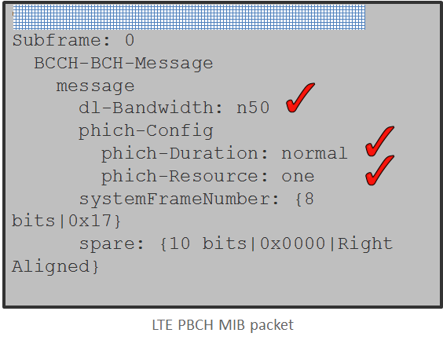
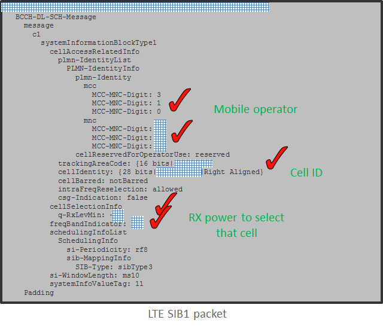
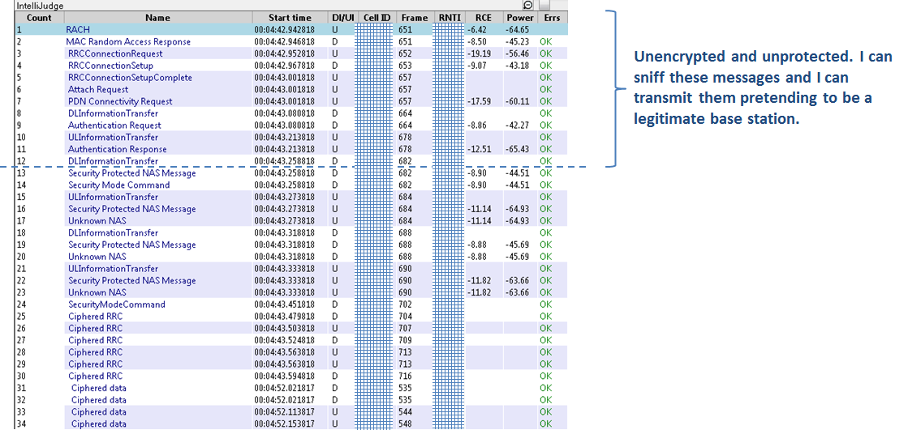
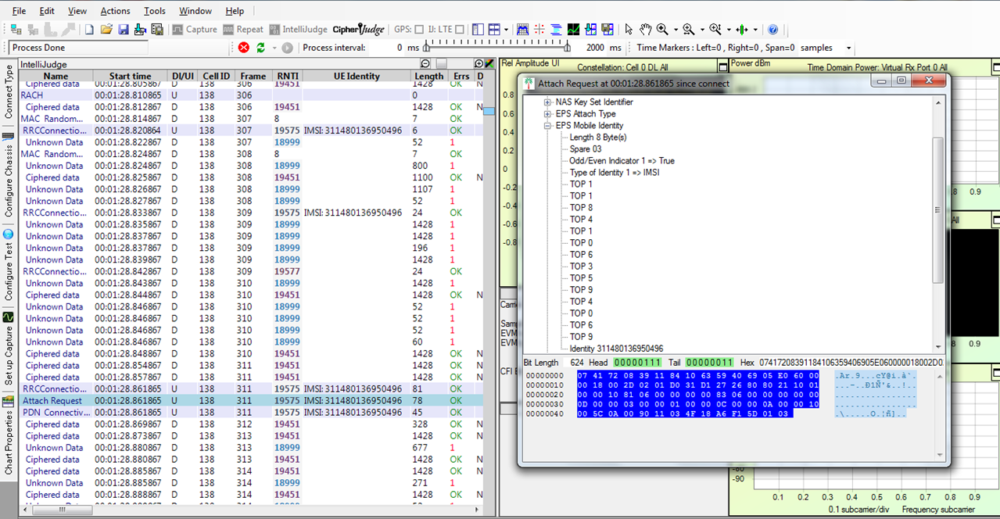
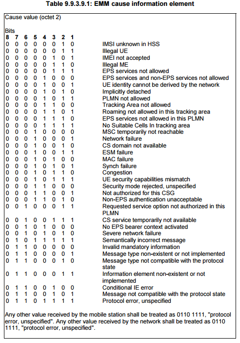
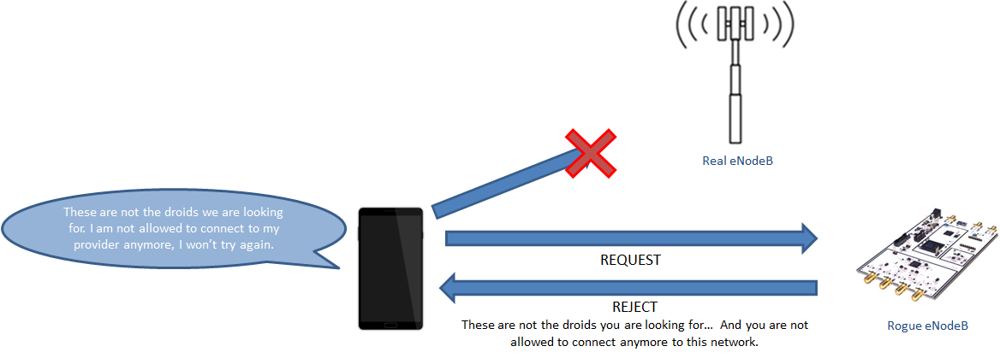
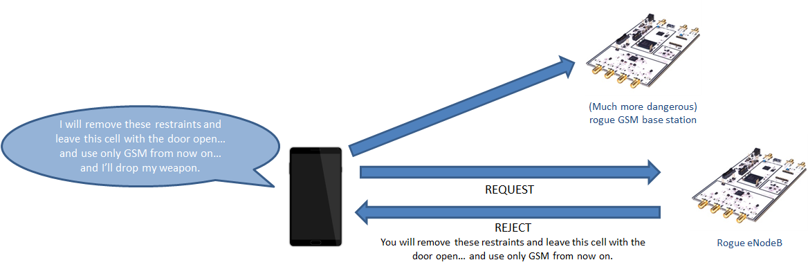
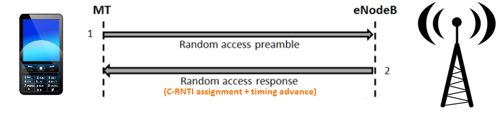
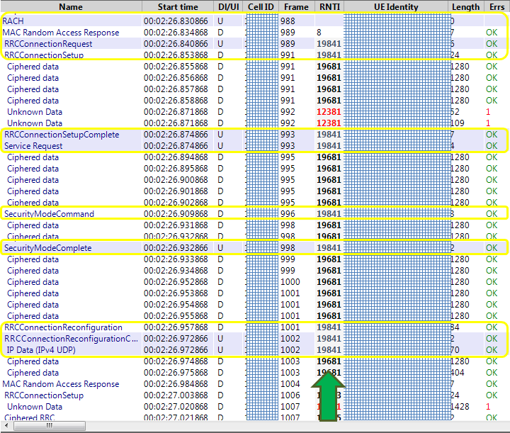
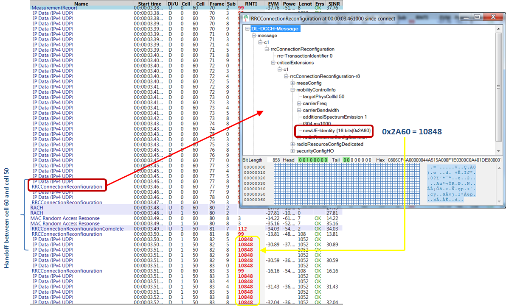

# LTE security and protocol exploits

### Introduction

The Long Term Evolution (LTE) is the newest standard being deployed globally for mobile communications. Despite the well understood security flaws of the Global System for Mobile Communications (GSM), LTE is generally considered secure given its mutual authentication and strong encryption scheme [LTE_book].

To the day, the main cellular vulnerabilities being exploited are based on 2G rogue base stations. The wide availability for years of open source implementations of the GSM stack, for example through the OsmocommBB project [osmocomm], have fueled a large number of security research projects. However, mobile security research focused on current LTE networks has been close to nonexistent.

Based on an open source implementation of LTE, openLTE [openLTE], this manuscript summarizes work performed over the last 4 years and demonstrates that, despite the strong crypto and mutual authentication of LTE, rogue base stations and protocol exploits are also possible in LTE. Before the authentication and encryption steps of a connection are executed, a mobile device engages in a substantial exchange of messages with *any* LTE base station (real or rogue) that advertises itself with the right broadcast information. And this broadcast information is sent in the clear and can be easily sniffed.

**Due to space limitations, the background on LTE networks has been omitted from this document. The description and implementation of the exploits has also been substantially trimmed down. The complete technical report will be hosted at the author's website:** http://www.ee.columbia.edu/~roger/exploits_Shmoo.pdf

The video of this talk can be found here: https://www.youtube.com/watch?v=bNo39JgR67U

### Tools and traffic captures

The LTE protocol exploit experimentation described in this manuscript has been done with the following set-up:

- [USRP B210](https://www.ettus.com/product/details/UB210-KIT) + [GPSDO kit](https://www.ettus.com/product/details/GPSDO-TCXO-MODULE)
- LTE multi-band [antennas](http://www.wpsantennas.com/SPDA247002700-Swivel-Blade-omnidirection.aspx)
- Core i7 PC running Ubuntu 15.04
- Gnuradio 3.7
- openLTE with custom modifications

Please note that all active experimentation must be done inside a Faraday cage to comply with regulations.

All the traffic captures displayed in this manuscript were obtained with a Sanjole Wavejudge LTE sniffer and protocol analyzer [Sanjole]. The traffic capture analysis was performed with the Wavejudge software provided by the same vendor.

### LTE security and protocol exploits

#### MIB and SIB message eavesdropping

The MIB and SIB messages are broadcasted and mapped on the LTE frame over radio resources known a priori. Moreover, these messages are transmitted with no encryption. Therefore, any passive sniffer is able to decode them. This could be potentially leveraged by an attacker to craft sophisticated jamming attacks, optimize the configuration of a rogue base station or tune other types of sophisticated attacks.

*Figure 1: LTE MIB message*

*Figure 2: LTE SIB1 message*

Figures 1 and 2 show an example of the contents of a MIB and SIB1 message broadcasted by a commercial eNodeB in the area of New York City. From the information extracted from MIB and SIB messages, one can learn the mobile operator that operates that cell, the tracking area code, optimal transmitted power for a rogue base station, etc. One of the most useful pieces of information, from a protocol exploit point of view, is the list of high priority frequencies, which will be used later to trigger UEs to camp to a rogue base station.

#### LTE insecurity rationale

Figure 3 plots the actual message exchange between a mobile device and an eNodeB in order to establish a connection. As highlighted in the figure, despite the fact that encryption is triggered upon mutual authentication, there is a large number of messages exchanged prior to the authentication step, with all this messages being sent in the clear and without integrity protection. In other words, up to the Attach Request message that a UE sends to the network, a rogue base station can communicate and the UE will have no way to determine its legitimacy.

*Figure 3: Initial connection to an LTE network sniffed from a real production network in the area of Honolulu, HI*

Aside from all the messages up to the Attach Request packet, there is a long list of other items transmitted in the clear that can be leveraged in a number of protocol exploits: UE measurement reports, handover trigger messages, paging messages, etc.

#### LTE IMSI catcher (Stingray)

An IMSI catcher [IMSI_catcher], commonly known as Stingray, is an active radio device that impersonates a, in its most frequent form, GSM base station. In its most basic functionality, the IMSI catcher receives connection/attach request messages from all mobile devices in its vicinity. These attach messages are forced to disclose the SIM's IMSI, thus allowing the IMSI catcher to retreive the IMSI for all devices in its vicinity.

More advanced Stingrays actually complete the GSM network attach process, fully impersonating a real base station. At that point, they can effectively act as a Man in the Middle (MitM) for the device's connection as long as it forwards the traffic and calls into and from the real mobile network.

*Figure 4: Attach Request message capture containing an IMSI transmitted in the clear*

Although it is well understood that a MitM Stingray is only possible in GSM, there is a general assumption that LTE IMSI catchers are not possible. However, a fully LTE IMSI catcher is possible to implement. In the context of this project, a fully operational LTE IMSI catcher was implemented on a USRP B210 running a modified version of openLTE. The device was successfully tested in a Farady cage. Figure 4 presents a real capture in which a mobile device is disclosing its IMSI to the LTE IMSI catcher. This was a controlled experiment in an isolated environment.

#### Temporary blocking mobile devices

A basic implementation of an LTE-based IMSI catcher replies with an Attach Reject message to the Attach Request petition, allowing the device to rapidly re-connect with the legitimate network. As with other pre-authentication messages, the Attach Reject message is sent in the clear.

3GPP defines a series of "cause codes" that the network utilizes to indicate mobile devices the reason why, for example, a connection is not allowed [3GPP_TS_24.301]. Some of the EMM causes indicate the device that it is not allowed to connect to the network, which is a way a network provider can block a customer who engages in, for example, mobile fraud, spam, etc.

  
*Figure 5: EMM Cause codes extracted from [3GPP_TS_24.301].*

If a rogue base station replies to an incoming connection with an Attach Reject message, it can indicate to the mobile device that it is not allowed to connect to that given network. As a result, the device will stop attempting to connect to any base station that broadcasts the same MNC-MCC code as the rogue base station. Figure 6 illustrates this exploit by which a rogue base station effectively prevents any mobile device in its radio communication range from connecting to the network, resulting in a Denial of Service (DoS).

*Figure 6: Mobile device temporary block by a rogue LTE base station.*

It is important to note that this is just a temporary DoS threat. By simply rebooting the device or, resetting the SIM or toggling airplane mode the device is capable again to attempt connecting to the network. The impact could be more severe, though, in the case of an embedded device connected to the mobile network, i.e. an IoT (Internet of Things).

LTE mobile devices implement a timer (T3245) which is started when an Attach Reject message blocks the device from further attempting to connect. Upon expiration of this timer, the mobile device is allowed again to communicate and attach with the blocked network. According to the standards, timer T3245 is configured to a value between 24 and 48 hours [3GPP_TS_24.301]. As a result, even in the context of an embedded sensor, the DoS would only be sustained for 24 to 48 hours.

This same attack can be also carried over by means of replying with a reject message to the Traffic Area Update (TAU) message. By means of configuring a rogue base station with a different Tracking Area value than the legitimate base stations in the area, one can trigger TAU messages from the devices that attempt to connect with the rogue base station.

This LTE protocol exploit was implemented by means of a modified version of openLTE running on a USRP B210. All the experiments were carried in a controlled environment (Faraday cage) resulting in the blocking of the author's smartphone. No experimentation was carried over to determine the value of the timer T3245 because the author could not go about without his phone for 24 hours. Excellent further analysis and results of this threat can be found in [LTE_exploits].

#### Soft downgrade to GSM

In a similar fashion, an attacker can trigger a soft downgrade of the connection to GSM, known for being highly insecure [GSM_SNIFFING]. Exploiting the same TAU Reject and Attach Reject messages, a rogue base station can indicate a victim mobile device that it is not allowed to access 3G and LTE services on that given operator. As a result, the mobile device will then only attempt to connect to GSM base stations.

*Figure 7: Mobile downgraded to a GSM connection by a rogue LTE base station.*

#### LTE device tracking with C-RNTI

Further LTE protocol exploits could potentially allow a passive adversary to locate and track devices and users.

The Cell Random Network Temporary Identifier (C-RNTI, RNTI for short from here on) is a PHY layer identifier unique per device within a given cell. This 16-bit identifier is assigned, in the clear, to each mobile device during the Random Access Procedure [LTE_book].

*Figure 8: RNTI assignment in the RACH LTE procedure.*

Passive analysis of real LTE traffic indicates that the RNTI is included in the header, in the clear, of the PHY layer encapsulation of every single packet, regardless of whether it's signaling or user traffic. This allows, as shown in Figure 9, a passive observer to easily map traffic, regardless of its encryption, to an individual device or user.

*Figure 9: Identifying the traffic of a given device with the RNTI.*

Mapping of a TMSI or MSISDN to the RNTI is trivial. Once this PHY layer id is known, a passive eavesdropper can know for how long a given user stays at a given location. Observations of real LTE traffic from the major operators in the United States indicates that often the RNTI remains static for long period of times.

Moreover, assuming that the control plane traffic load in a given device is much lower than the user data load, the RNTI could also be leveraged to estimate the UL and DL traffic load of a given device. This could potentially allow and adversary to identify the connectivity hotspot of an ad-hoc LTE-based network, such as the ones being considered for both first responders [FirstNet] and tactical scenarios [LTE_tactical].

Further analysis of LTE traffic uncovered a potential way a passive eavesdropper could track a given device during mobility handover events.

An LTE handover is triggered by the source eNodeB through the RRC Connection Reconfiguration Message. In this packet, the source eNodeB indicates the UE what is the destination eNodeB and provides some parameters necessary for the UE to connect to the new tower. Upon reception of this message, the UE performs a random access procedure with the destination eNodeB, which assigns it a new RNTI. At this point, the handover is complete and the UE connects with the destination eNodeB.

During the investigation process, it was discovered that the RNTI that was initially assigned to the UE by the destination eNodeB was always updated via an RRC Connection Reconfiguration message. Further inspection of the captures highlighted that, in the original RRC Connection Reconfiguration message sent from the source eNodeB, a new RNTI is explicitly provided by the eNB in a Mobility Control Info container [3GPP_TS_36.300]. This RNTI being explicitly provided matches the RNTI that is assigned to the UE at the destination cell via the RRC Connection Reconfiguration message.

Based on observations of real LTE traffic in the areas of New York City and Honolulu, the message that triggers the handover process appears to be sent in the clear. As a result, a passive eavesdropper can potentially track a given device in a cell and, upon a handover event, follow the connection to the destination cell (indicated in the message that triggers the handover) and intercept the RNTI that is assigned to the device in this new cell.

*Figure 10: RNTI device tracking during a handover process.*

Figure 10 presents an example of such device tracking during a handover process. In the figure, a UE with RNTI 99 is connected to cell id 60. At some point it receives an RRC Connection Reconfiguration triggering the connection to be handed over to cell id 50 and explicitly indicates the UE that its new RNTI at the destination cell will be 10848 (0x2A60). The UE performs a random access procedure and is assigned an RNTI 112 via de MAC RAR message. However, shortly after the handover, the destination eNB (cell id 50) sends an RRC Connection Reconfiguration message that assigns the final RNTI at the destination cell, 10848. Note that, as part of the handover process, the UE still receives a couple of RRC messages from the source eNB (cell id 60) when it has already connected to the destination eNB and this are addressed to the old RNTI 99.

### Acknowledgments

The author would like to express his gratitude to the team at Sanjole for providing the captures used in this document.

### References

[LTE_exploits] Shaik, Altaf, et al. "Practical attacks against privacy and availability in 4G/LTE mobile communication systems" arXiv preprint arXiv:1510.07563 (2015).

[LTE_book] Sesia, Stefania. LTE: the UMTS long term evolution. New York: John Wiley & Sons, 2009.

[osmocomm] Eversberg, A., H. Welte, and S. Munaut. "Osmocom-bb." (http://bb.osmocom.org/trac/)

[openLTE] Wojtowicz, Ben. "OpenLTE." An open source 3GPP LTE implementation (http://openlte.sourceforge.net/).

[LTE_jamming] Jover, Roger Piqueras, Joshua Lackey, and Arvind Raghavan. "Enhancing the security of LTE networks against jamming attacks." EURASIP Journal on Information Security 2014.1 (2014): 1-14.

[Sanjole] The WaveJudge 5000 Wireless Test System. Sanjole. (http://www.sanjole.com/our-products/wavejudge-test-system/)

[GSM_SNIFFING] Nohl, Karsten, and Sylvain Munaut. "Wideband GSM sniffing." In 27th Chaos Communication Congress. 2010.

[IMSI_catcher] Strobel, Daehyun. "IMSI catcher." Chair for Communication Security, Ruhr-Universität Bochum (2007): 14. http://www.emsec.rub.de/media/crypto/attachments/files/2011/04/imsi_catcher.pdf

[3GPP_TS_24.301] 3rd Generation Partnership Project, “Non-Access-Stratum (NAS) protocol for Evolved Packet System (EPS); Stage 3,” 3GPP TS 24.301 V9.3.0, June 2010.

[3GPP_TS_36.300] LTE, ETSI. "Evolved Universal Terrestrial Radio Access (E-UTRA) and Evolved Universal Terrestrial Radio Access Network (E-UTRAN)(3GPP TS 36.300, version 8.11. 0 Release 8), December 2009." ETSI TS 136.300: V8.

[FirstNet] Doumi, Tewfik, et al. "LTE for public safety networks." Communications Magazine, IEEE 51.2 (2013): 106-112.

[LTE-tactical] Hong-jun, J. I. N. "Development Progress of LTE-based Tactical Communications System [J]." Telecommunication Engineering 8 (2012): 036.

#### Metadata

Tags: LTE, mobile, security, protocol exploit, stingray, IMSI catcher, location leak

**Author name**: Roger Piqueras Jover  
**Author affiliation**: Bloomberg LP - Security Architecture  
**Author email**: rpiquerasjov@bloomberg.net

