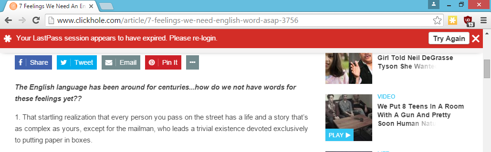
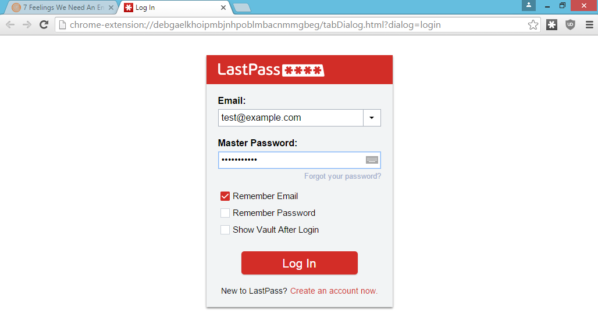
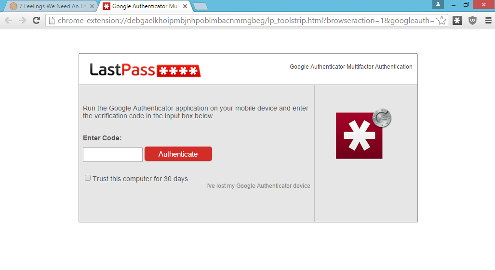

# LostPass
### Pixel-perfect LastPass Phishing

# Abstract

LastPass holds all of your secrets. Its login prompts and alerts occur within the browser window, which attackers can control. When the victim visits the target site–which can look completely inconspicuous, such as a news website–after a delay a LastPass notification will appear if the user has LastPass installed prompting the user to log in because their session has expired. The log in screen, which always appears within the browser window, is customized for each browser and operating system to appear pixel perfect. This sends the user’s credentials to the attacker, and then can be prompted for two-factor authentication if required. The attacker can then use the LastPass API to remotely download and decrypt all passwords, credit cards, and secure notes. The LostPass tool can be downloaded via [Github][github].

# Content

A few months ago, [LastPass][lastpass] displayed a message on my browser that
my session had expired and I needed to log in again. I hadn't used LastPass in
a few hours, and hadn't done anything that would have caused me to be logged
out. When I went to click the notification, I realized something: it was
displaying this in the browser viewport. An attacker could have drawn this
notification.

Any malicious website could have drawn that notification. Because 
LastPass trained users to expect notifications in the browser viewport, they 
would be none the wiser. The LastPass login screen and two-factor prompt are 
drawn in the viewport as well.

Since LastPass has an API that can be accessed remotely, an attack materialized
in my mind.

## The Attack

Here are the steps for LostPass, in order.

### Visit the malicious site

Get the victim to go to a malicious website that looks benign, or a real
website that is vulnerable to XSS. This is where we'll deploy lostpass.js.
Unlike most phishing attacks, users won't be on their guard because this isn't
supposed to be a secure website. It could be a funny video or image, even.

### Check for LastPass and show the notification

If they have LastPass installed, show the login expired notification and log
the user out of LastPass. LastPass is vulnerable to a logout [CSRF][csrf], so
any website can log any user out of LastPass. This will make it appear to the
user that they are truly logged out.

### Direct the victim to the login page

Once the victim clicks on the fake banner, direct them to an
attacker-controlled login page that looks identical to the LastPass one. This
is the login page for Chrome.

Notice the domain, "chrome-extension.pw". This looks similar to the Chrome
protocol for real extensions "chrome-extension". There is an [open issue in
Chromium][chromebug] to address this.

### Get the credentials

The victim will enter their password and send the credentials to the
attacker's server. The attacker's server will check if the credentials are
correct by calling LastPass's API. The API will inform us if two-factor 
authentication is required.

If the username and password is incorrect, we'll redirect the user back to the
malicious website, but this time, the LostPass notification bar will say
"Invalid Password".

If the user has two-factor authentication, redirect them to a two-factor
prompt, like so:

### Download the vault

Once the attacker has the correct username and password (and two-factor
token), download all of the victim's information from the LastPass API. We can
install a backdoor in their account via the emergency contact feature, disable
two-factor authentication, add the attacker's server as a "trusted device".
Anything we want, really.

## Gathering the HTML

Since LastPass displays its error messages for Chrome and login screens within 
the DOM of the browser, it is trivial to get the HTML. A simple right click and
then inspecting the element in question is enough to bring up the relevant part
of the HTML in a browser's developer tools. Copying and pasting this into
another file is enough.

One obstacle for Chrome is the "chrome-extension" protocol used for the login
screen. The URL looks like:

    chrome-extension://debgaelkhoipmbjnhpoblmbacnmmgbeg/tabDialog.html?dialog=login

Because of the visual noise and because Chrome uses the same icon for
chrome-extension as for unencrypted connections, a spoofed domain was needed.
The following URL is was chosen for LostPass because of its similarity to the
real thing:

    chrome-extension.pw://debgaelkhoipmbjnhpoblmbacnmmgbeg/tabDialog.html?dialog=login

For Firefox, the error messages are in the DOM but not the login screen. The
login screen was drawn and animated by hand using HTML 5 and CSS 3.

## Detecting LastPass

Since LastPass draws in the DOM, it is easy to check for it by inserting a
username and password form into the DOM, waiting for LastPass to draw its icon
and then checking to see if it was drawn. One way to do this is:

    function isLastPassInstalled() {
        var username = document.getElementById("usernameForm");
        var style = username.getAttribute("style");
        return (style != null && style.indexOf("background-image") > -1);
    }

Since the LastPass user experience differs from browser to browser, detection
code was added to display the various different iterations of the warning
message or login screens.

## Logout CSRF

One simple way to beat the LostPass attack would be to look at the LastPass
icon in the browser. It is red when logged in and active, and yellow or gray
when logged out. By looking at [LastPass's out-of-scope bug bounty
list][bugcrowd], it was clear that they had a logout cross-site request
forgery. This means that anyone can log users out of LastPass from any site.

The following HTML logs LastPass users out:

    

## Executing the attack

A simple Python script was written to accept requests from the attacking page.
This integrated with an open source LastPass API implementation called
[lastpass-python][lastpasspython].

The username and password are sent to the Python script, which then attemps to
login to LastPass. The API either returns the decrypted vault, or throws an
exception indicating incorrect password or two-factor authentication needed. If
two-factor authentication is needed, an HTTP 307 redirect is issued to show the
user the two-factor prompt. The user then types in their auth code and send
that back to the attacker. The attacker can then login and decrypt the entire
vault.

### Two-factor Authentication

LastPass had a mitigation in place for this attack: all logins from new IP
addresses required email approval. However, if two-factor authentication was
enabled, this was skipped. Therefore, if two-factor authentication was enabled
on a LastPass user's account, they were more susceptible to this attack than if
they were not.

## Previous Work

Vigo and Garcia presented a local attack against LastPass entitled, "[Even the
LastPass Will be Stolen, Deal with It!][vigo]". Their work is a sophisticated
client-side attack that relies on bad design choices that LastPass made that
make it vulnerable to compromised machines.

This work comes at LastPass from a different angle: you don't have access to a
LastPass user's machine. Instead, you trick the user into giving you their
credentials.

## Conclusions

Phishing a password manager is, for many users, the worst phish possible. All
of their passwords are gone in an instant. All of their saved credit cards,
private documents, and more are nabbed by an attacker in one fell swoop.

User experiences must be designed with phishing in mind. Explicit anti-phishing
measures like choosing a background color make phishing attacks like this much
more challenging. Browser extensions often draw their widgets in the DOM, which
makes it easy for attackers to find out which extensions are installed and
allows them to hijack their normal workflow.

Other password managers and other browser extensions are likely vulnerable to
this type of flaw.

#### Metadata

Tags: phishing,passwords,web,lastpass

**Primary Author Name**: Sean Cassidy
**Primary Author Affiliation**: Praesidio
**Primary Author Email**: sean@seancassidy.me 
**Primary Author Twitter**: @sean_a_cassidy

[lastpass]: https://en.wikipedia.org/wiki/LastPass
[github]: https://github.com/cxxr/lostpass
[vigo]: http://www.martinvigo.com/even-the-lastpass-will-be-stolen-deal-with-it/
[chromebug]: https://code.google.com/p/chromium/issues/detail?id=453093
[csrf]: https://en.wikipedia.org/wiki/Cross-site_request_forgery
[lastpasspython]: https://github.com/konomae/lastpass-python
