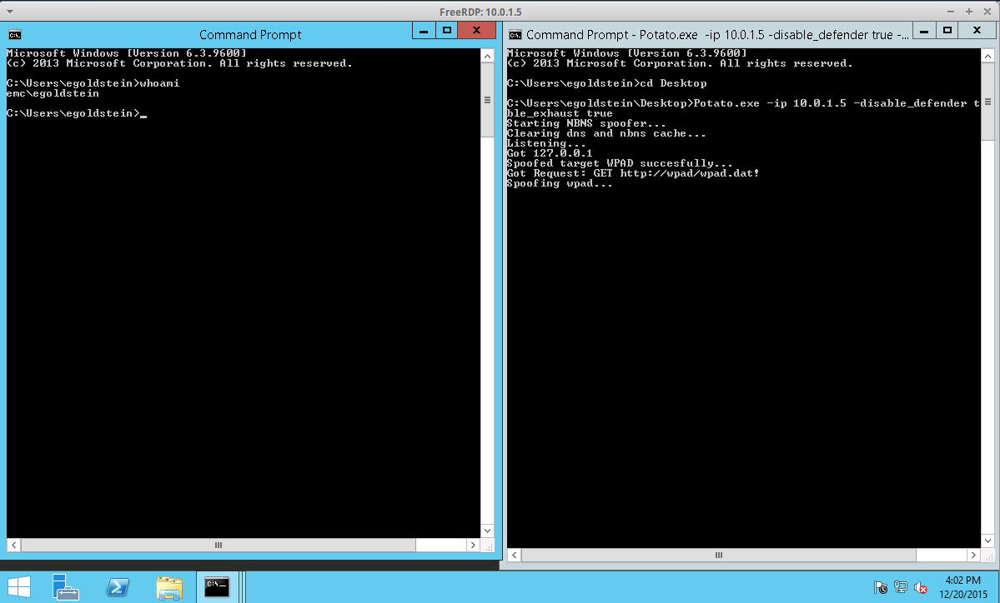
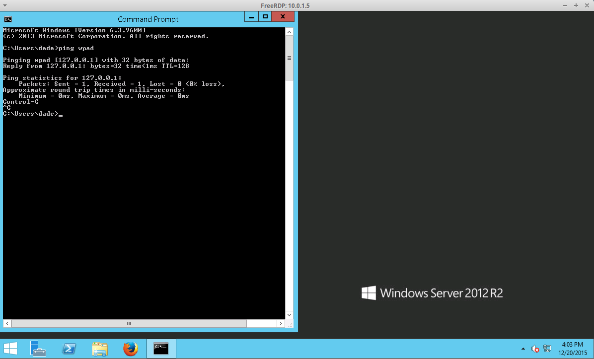

#Hot Potato

###Privilege Escalation on Windows 7,8,10, Server 2008, Server 2012 ... and a new network attack

##How it works

Hot Potato (aka: Potato) takes advantage of known issues in Windows to gain local privilege escalation in default configurations, namely NTLM relay (specifically HTTP->SMB relay) and NBNS spoofing.

If this sounds vaguely familiar, it's because a similar technique was disclosed by the guys at Google Project Zero - https://code.google.com/p/google-security-research/issues/detail?id=222 . In fact, some of our code was shamelessly borrowed from their PoC and expanded upon.

Using this technique, we can elevate our privilege on a Windows workstation from the lowest levels to "NT AUTHORITY\SYSTEM" - the highest level of privilege available on a Windows machine.

This is important because many organizations unfortunately rely on Windows account privileges to protect their corporate network. Often it is the case that once an attacker is able to gain high privileged access to ANY workstation or server on a Windows network, they can use this access to gain "lateral movement" and compromise other hosts on the same domain. As an attacker, we often gain access to a computer through a low privilege user or service account. Gaining high privilege access on a host is often a critical step in a penetration test, and is usually performed in an ad-hoc manner as there are no known public exploits or techniques to do so reliably.

The techniques that this exploit uses to gain privilege escalation aren't new, but the way they are combined is. Microsoft is aware of all of these issues and has been for some time (circa 2000). These are unfortunately hard to fix without breaking backward compatibility and have been leveraged by attackers for over 15 years.

The exploit consists of 3 main parts, all of which are somewhat configurable through command-line switches. Each part corresponds to an already well known attack that has been in use for years:

###1. Local NBNS Spoofer

NBNS is a broadcast UDP protocol for name resolution commonly used in Windows environments. When you (or Windows) perform a DNS lookup, first Windows will check the "hosts" file. If no entry exists, it will then attempt a DNS lookup. If this fails, an NBNS lookup will be performed. The NBNS protocol basically just asks all hosts on the local broadcast domain "Who knows the IP address for host XXX?". Any host on the network is free to respond however they wish.

In penetration testing, we often sniff network traffic and respond to NBNS queries observed on a local network. We will impersonate all hosts, replying to every request with our IP address in hopes that the resulting connection will do something interesting, like try to authenticate.

For privilege escalation purposes, we can't assume that we are able to sniff network traffic. Why? Because this requires local administrator access. So how can we accomplish NBNS spoofing?

If we can know ahead of time which hostname a target machine (in this case our target is 127.0.0.1) will be sending an NBNS query for, we can craft a fake response and flood the target host with NBNS responses very quickly (since it is a UDP protocol). One complication is that a 2-byte field in the NBNS packet, the TXID, must match in the request and response, and we are unable to see the request. We can overcome this by flooding quickly and iterating over all 65536 possible values.

What if the network we are targeting has a DNS record for the host we want to spoof? We can use a technique called UDP port exhaustion to force ALL DNS lookups on the system to fail. All we do is bind to EVERY single UDP port. This causes DNS to fail because there will be no available UDP source port for the request. When DNS fails, NBNS will be the fallback.

In testing, this has proved to be 100% effective due to the speed we are able to send UDP packets to 127.0.0.1.

###2. Fake WPAD Proxy Server

In Windows, Internet Explorer by default will automatically try to detect network proxy setting configuration by accessing the URL "http://wpad/wpad.dat". This also surprisingly applies to some Windows services such as Windows Update, but exactly how and under what conditions seems to be version dependent.

Of course the URL "http://wpad/wpad.dat" wont exist on all networks because the hostname "wpad" wont necessarily exist in the DNS nameserver. However as we saw above, we can spoof host names using NBNS spoofing.

With the ability to spoof NBNS responses, we can target our NBNS spoofer at 127.0.0.1. We flood the target machine (our own machine) with NBNS response packets for the host "WPAD", or "WPAD.DOMAIN.TLD", and we say that the WPAD host has IP address 127.0.0.1.

At the same time, we run an HTTP server locally on 127.0.0.1. When it receives a request for "http://wpad/wpad.dat", it responds with something like the following:

```
FindProxyForURL(url,host){
if (dnsDomainIs(host, "localhost")) return "DIRECT";
return "PROXY 127.0.0.1:80";}
```

This will cause all HTTP traffic on the target to be redirected through our server running on 127.0.0.1.

Interestingly, this attack when performed by even a low privilege user will affect all users of the machine. This includes administrators and system accounts. The following screenshot shows two users simultaneously logged into the same machine, the low privilege user is performing local NBNS spoofing, the high privilege user is affected in the second screenshot.

 

###3. HTTP -> SMB NTLM Relay

NTLM relay is a well known, but often misunderstood attack against Windows NTLM authentication. The NTLM protocol is vulnerable to man-in-the-middle attacks. If an attacker can trick a user into trying to authenticate using NTLM to his machine, he can relay that authentication attempt to another machine!

The old version of this attack had the victim attempting to authenticate to the attacker using the SMB protocol with NTLM authentication. The attacker would then relay those credentials back to the victim's computer and gain remote access using a "psexec" like technique.

Microsoft patched this by disallowing same-protocol NTLM authentication using a challenge that is already in flight. What this means is that SMB->SMB NTLM relay from one host back to itself will no longer work. However cross-protocol attacks such as HTTP->SMB will still work with no issue!

With all HTTP traffic now presumably flowing through an HTTP server that we control, we can do things like redirect them somewhere that will request NTLM authentication.

In the Potato exploit, all HTTP requests are redirected with a 302 redirect to "http://localhost/GETHASHESxxxxx", where xxxxx is some unique identifier. Requests to "http://localhost/GETHASHESxxxxx" respond with a 401 request for NTLM authentication.

Any NTLM credentials are then relayed to the local SMB listener to create a new system service that runs a user-defined command.

When the HTTP request in question originates from a high privilege account, for example, when it is a request from the Windows Update service, this command will run with "NT AUTHORITY\SYSTEM" privilege!

## Using The Exploit
Usage is currently operating system dependent.

It is also a bit flaky sometimes, due to the quirks in how Windows handles proxy settings and the WPAD file. Often when the exploit doesn't work, it is required to leave it running and wait. When Windows already has a cached entry for WPAD, or is allowing direct internet access because no WPAD was found, it could take 30-60 minutes for it to refresh the WPAD file. It is necessary to leave the exploit running and try to trigger it again later, after this time has elapsed.

The techniques listed here are ordered from least to most complex. Any technique later in the list should work on all versions previous. Videos and screenshots are included for each.

### Windows 7 - see https://youtu.be/Nd6f5P3LSNM

Windows 7 can be fairly reliably exploited through the Windows Defender update mechanism.

Potato.exe has code to automatically trigger this. Simply run the following:

```
Potato.exe -ip -cmd [cmd to run] -disable_exhaust true
```

This will spin up the NBNS spoofer, spoof "WPAD" to 127.0.0.1, then check for Windows Defender updates.

If your network has a DNS entry for "WPAD" already, you can try "-disable_exhaust false". This should cause the DNS lookup to fail and it should fallback to NBNS. This seems to work pretty reliably on Windows 7.

### Windows Server 2008 - See https://youtu.be/z_IGPWgL5SY

Since Windows Server doesn't come with Defender, we need an alternate method. Instead we'll simply check for Windows updates. The other caveat is that, at least on my domain, Server 2K8 wanted WPAD.DOMAIN.TLD instead of just WPAD. The following is an example usage:

```
Potato.exe -ip -cmd [cmd to run] -disable_exhaust true -disable_defender true -spoof_host WPAD.EMC.LOCAL
```

After this runs successfully, simply check for Windows updates. If it doesn't trigger, wait about 30m with the exploit running and check again. If it still doesn't work, try actually downloading an update.

If your network has a DNS entry for "WPAD" already, you can try "-disable_exhaust false", however it might break things here. Doing DNS port exhaustion causes ALL DNS lookups to fail. The Windows Update process may need to do a few DNS lookups before reaching out for WPAD. You would have to nail the timing JUST right to get it working in this case.

### Windows 8/10/Server 2012 - See https://youtu.be/Kan58VeYpb8

In the newest versions of Windows, it appears that Windows Update may no longer respect the proxy settings set in "Internet Options", or check for WPAD. Instead proxy settings for Windows Update are controlled using "netsh winhttp proxy..."

Instead for these versions, we rely on a newer feature of Windows, the "automatic updater of untrusted certificates". Details can be found https://support.microsoft.com/en-us/kb/2677070 and https://technet.microsoft.com/en-us/library/dn265983.aspx

From the technet article "The Windows Server 2012 R2, Windows Server 2012, Windows 8.1, and Windows 8 operating systems include an automatic update mechanism that downloads certificate trust lists (CTLs) on a daily basis."

It appears that this part of Windows still uses WPAD, even when the winhttp proxy setting is set to direct. Why is a bit of a mystery...

In this case the usage of Potato is as follows:

```
Potato.exe -ip -cmd [cmd to run] -disable_exhaust true -disable_defender true
```

At this point, you will need to wait up to 24hrs or find another way to trigger this update.

If your network has a DNS entry for "WPAD" already, refer to the documentation for this situation in Server 2008. You can try port exhaustion but it might be tricky.

### TODO: SMB Signing?

It's unclear whether this attack would work when SMB signing is enabled. The exploit as released currently does not, but this may just be due to lack of SMB signing support in the CIFS library we're using. My reason to suspect that it may work is that everything is happening on 127.0.0.1. If the signatures are host based, they may still match?

### The "New Network Attack"

Let's think back to our NBNS spoofing attack.

Using the same technique of brute-forcing the TXID, we could technically perform NBNS spoofing attacks outside of our local network. In fact, in theory, as long as there is a fast enough connection to support it, we should be able to perform NBNS spoofing attacks against ANY Windows hosts for which we can talk to UDP port 137.

This actually appears to work in practice, at least on local network, I've yet to successfully try it over the Internet.

We're releasing a modified version of the "Responder.py" tool that performs this attack. The following video demonstrates the attack on a network laid out as follows:

PFSense firewall
10.0.0.0/24 -> Corporate LAN
10.0.1.0 /24 -> Server network
From the corporate network, we’ll attack a machine on the
server network.
Demo: https://youtu.be/Mzn7ozkyG5g

### Code

Those interested in trying this out themselves or building upon it can find all of the code on our GitHub page: https://github.com/foxglovesec/Potato

#### Metadata

Tags: Windows, Privilege Escalation, Potato, NBNS Spoofing, NTLM Relay, WPAD spoofing

**Primary Author Name**: Stephen Breen
**Primary Author Affiliation**: FoxGlove Security
**Primary Author Email**: stephen.breen@nttcomsecurity.com
