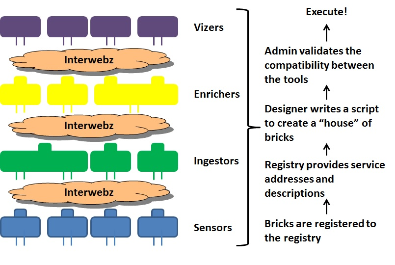
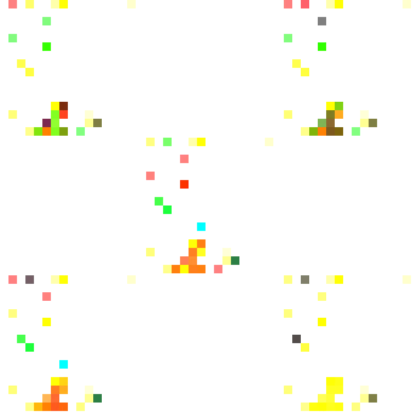
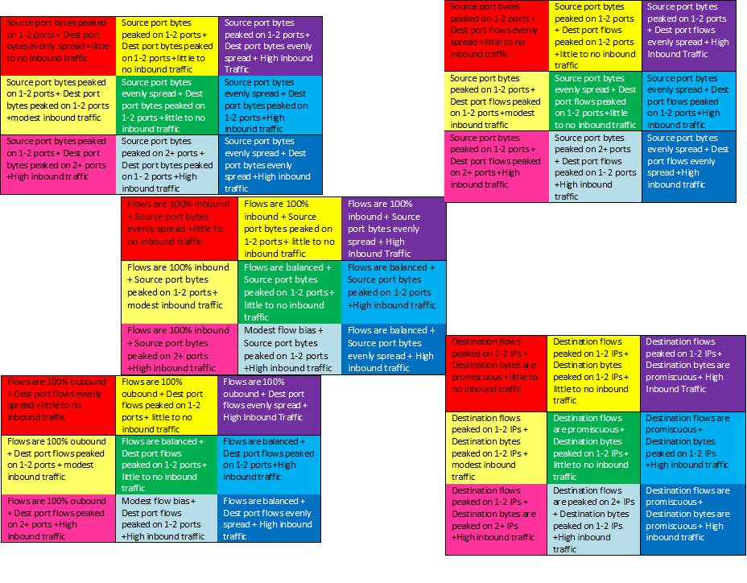

# Compressed Context Based Analytic Results for Use in Computer Vision System for Network Defense

# Abstract

We have been developing ideas on how to present large analytic results to analysts for making decisions in defending their networks.

We developed a concept to provide the output network data and analytics through mathematically driven visualizations. In our example, we show 1024 analytics in a 16 by 16 pixel BMP. This capability stores 4 analyses in 1 pixel, and each pixel has a context and tells a story. 

Utilizing a Hilbert Space Filling Curve to plot this pixel in the BMP, this story-context lends itself to representing a computer network architecture very well, as each octet of the network address space can be plotted in a 16 by 16 grid, and the grid can be updated in real time to show time (like the Grateful Dead). The analytic results are used to create a single BMP every 5 seconds. 

We are building toward applying a computer vision algorithm to send alerts to the analyst, when the change in the results meet their criteria for alert generation. This conveys the context-based story of the changes to the network over time to the analyst, helping them better defend their network.

# Crazy and More Crazy

## Introduction - Why Did We Do This?

Our work is driven by two factors that we believe strongly to be true:

+ Factor 1: Humans are natively equipped to deal with stable, non-scalable systems.
+ Factor 2: Our world is moving toward unstable, highly scalable systems.

In order for a human to conduct effective sparse pattern recognition, we must me able to contextualize it. Context is how we make sense of data: I need to get data, I need to organize it, I need a simple way to put an event or a behavior in context. To do this, we need to take advantage of fundamental strengths in the human brain for sparse pattern recognition, allowing the human to be the final analytics engine.

Our research goal is to allow any user – technical or otherwise – to interact with their network and network data just like they interact with the physical world: intuitively. Humans learn and process data visually. There are many data visualization techniques available, but Hilbert curves are particularly effective for network data because they allow the data to be represented in multiple dimensions.
 
We received inspiration for our idea from many sources. Vannevar Bush[^1] noted that "All our steps in creating or absorbing material of the record proceed through one of the senses" while William Gibson[^2] described a "a consensual hallucination that is a virtual representation of networking and computer systems" and Neal Stephenson[^3] talks about the power of metaphor in computer systems. Talks and demonstrations by Jeff Jonas[^4], and Chris Domas[^5] also show real examples of the application of these principles. 

## Methods

### Design Philosophy

Our approach has been to develop a layered set of tools so that we can quickly re-use them and build new streaming analytics and visual representations.

### Data Collection

Our network data is collected using netflow collectors and softlowd.  This collects and compresses flows, providing a netflow v5 binary. Our Github repository for our data sensing is [here.](https://github.com/delphornet/Sense)

### Data Ingest

We built a pluggable python library that converts the netflow binary to ASCII and parses the flow into its component parts.

Data is then organized into arrays for feeding to the enrichment tools (e.g., analytics).  Each array in our demo is specific to a network node and performs the following over a defined interval:

+ Array 0: Basic flow counts: count netflow packet traffic
+ Array 1: Destination Port Counts: counts the unique values of destination ports, both in terms of number of flows and volume of traffic
+ Array 2: Source Port Counts: counts the unique values of source ports, both in terms of number of flows and volume of traffic
+ Array 3: Destination IP Counts: counts the unique values of Destination IPs, both in terms of number of flows and volume of traffic

Our arrays are calculated against streaming data using [Apache Storm Streamparse](https://github.com/Parsely/streamparse)[^6]

Our Github repository for our data ingestion is [here.](https://github.com/delphornet/Ingest)

### Data Enrichment

Data enrichment is based on simple statistical operations using the above arrays: i) basic traffic counts, ii) a basic proportions calculation, and iii) the reuse of basic statistics - not to perform a test, but to describe the shape of the distribution (counts) in the arrays - using skewness and kurtosis.

Skewness[^7],[^8] describes the degree to which a distribution "skews" toward the left or the right of the mean - not meaningful for evaluating the "mean" of port values, but useful in understanding if the distribution is changing over time. Kurtosis[^9],[^10] describes the degree to which a distribution is "peaked" and therefore would allow you to describe how concentrated a set of observations is (think about this as the inverse of a promiscuous node). We used the [scipy describe](http://docs.scipy.org/doc/scipy-0.17.0/reference/generated/scipy.stats.describe.html)[^11] function. 

Finally, in order to support rapid, compressed visualization, we normalized our analytical function outputs into a 0-255 range to convert them to RGBA (red, green, blue, alpha) channels for visual streaming.

Our scipy and normalization functions were applied to the streaming arrays using [Apache Storm Streamparse](https://github.com/Parsely/streamparse)[^6]

Our Github repository for our data enrichment is [here.](https://github.com/delphornet/Enrich)

### Data Visualization

To visualize, the streaming enrichments, normalized to an RGBA scheme, we developed an algorithm to plot onto a Hilbert curve. A Hilbert space-filling curve is an efficient algorithm for plotting, it closely resembles natural number sequence, an resembles the structural design of IP networking. We then write our hilbert curve to a streaming mp4 file.

Our Github repository for our data visualization is [here.](https://github.com/delphornet/Viz)

## Results

Once we finally got all of this stuff to work, we were able to sensor, ingest, enrich, and visualize network traffic behaviors in real time. We were able to plot multiple analytic "channels" onto a Hilbert Space.

We also created a (not very simple) color-coded key to describe what is on the Hilbert curve. Clearly better navigation and annotation are required to make this more easily user accessible.

## Conclusions

We were able, by reusing components and learning from our past failures, to quickly assemble a streaming network analysis and visualization framework that compresses the results into a very small footprint - approximately 150K for 60 seconds of surveillance on a whack 24 network.

Our goal moving forward is to open source as much of our work as possible and seek collaborators to build a collaborative, distributed network of sensing, enrichment, and visualization. We are adding more documentation in our [github](https://github.com/delphornet) and on our Delphor [project website.](http://www.delphor.net/)

# References

[^1] [Bush, Vannevar, The Atlantic, July 1945](http://www.theatlantic.com/magazine/archive/1945/07/as-we-may-think/303881/) 

[^2] [Gibson, William; Neuromancer; Ace, New York City; 1984]

[^3] [Stephenson, Neal; In the Beginning Was the Command Line; Harper Collins, New York City; 1999]

[^4] [Jonas, Jeff; Context Computing; Strata + Hadoop 2015 NYC; September 2015](https://www.youtube.com/watch?v=rWDIkfpbTmQ&feature=player_embedded%27%27)

[^5] [Domas, Chris; The 1s and 0s behind cyber warfare; TED; June 2014](https://www.youtube.com/watch?v=cWpRxyqDgpM)

[^6] [Apache Streamparse](https://github.com/Parsely/streamparse)

[^7] Zwillinger, D. and Kokoska, S. (2000). CRC Standard Probability and Statistics Tables and Formulae. Chapman & Hall: New York. 2000.

[^8] [scipy skew](http://docs.scipy.org/doc/scipy-0.17.0/reference/generated/scipy.stats.skew.html#scipy.stats.skew)

[^9] [scipy kurtosis](http://docs.scipy.org/doc/scipy-0.17.0/reference/generated/scipy.stats.kurtosis.html#scipy.stats.kurtosis)

[^10] [scipy describe](http://docs.scipy.org/doc/scipy-0.17.0/reference/generated/scipy.stats.describe.html)

[^11] [scipy describe](http://docs.scipy.org/doc/scipy-0.17.0/reference/generated/scipy.stats.describe.html)

#### Metadata

Tags: (comma delimited)

**Primary Author Name**: Robert Weiss
**Primary Author Affiliation**: G2 Inc.
**Primary Author Email**: rob.weiss@g2-inc.com
**Additional Author Name**: John Eberhardt
**Additional Author Affiliation**: Adjunct Professor [George Mason University](https://www2.gmu.edu/); Partner, 3E Services 
**Additional Author Email**: john@delphor.com

