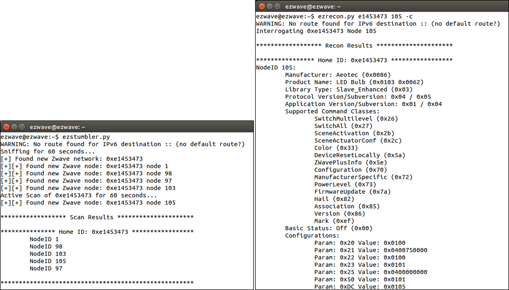
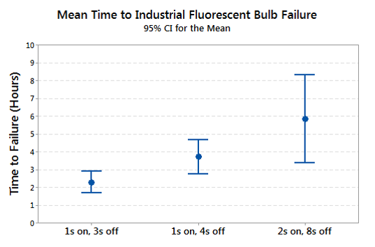

# Breaking Bulbs Briskly By Bogus Broadcasts

# Abstract
Smart energy and building automation are powerful technologies with significant promise. Unfortunately, the global rush to connect as many devices to the network as possible leads to unintended vulnerabilities. The ability to physically damage hardware by abusing network access is particularly interesting. This paper has two goals: 1) introduce an open source tool for pen-testing proprietary Z-Wave wireless automation networks and 2) discuss a rapid process for destroying fluorescent lights. Frustrated at the lack of functionality in current Z-Wave hacking tools, we introduce a tool called EZ-Wave. Regardless of the protocol used, once access is gained to an automated lighting system we demonstrate how to destroy fluorescent lamps rated for 30K hours within a single night of abuse.

# Z-Wave
With reportedly over 40M devices sold [^1], Z-Wave wireless sensor networks (WSNs) represent a respectable subset of the Internet of Things, particularly within the security and home automation markets. The Z-Wave Alliance boasts 375 member companies, including industry giants Samsung, General Electric, Verizon, LG, ADT, Lowe’s, and Honeywell. While open wireless standards like ZigBee and Wi-Fi have received significant attention from security researchers over the years, little effort has been given to evaluating the security implications of the proprietary Z-Wave protocol. 

Z-Wave is a low-rate wireless networking protocol operating in the 900 MHz ISM band. It is used in all kinds of “smart” devices from simple light bulbs, power plugs, and magnetic window/door sensors to door locks, environmental sensors, smoke detectors, to more physically robust devices like water/gas valves and smart meters.

For security, the protocol supports application layer encryption using AES-128. However, the use of this feature is left to individual device manufacturers. We tested 33 Z-Wave devices currently available on the market and found that only 9 support the use of encryption. The 9 devices include 5 door locks (all door locks tested) and 4 of some of the newest devices available. However, the manual for 3 of these devices give network inclusion instructions which add the device without the use of encryption. Buried toward the end of the manuals are alternate instructions for adding the device to the network with encryption.

# EZ-Wave
We set out to evaluate the security of Z-Wave by searching for available tools and found short list of 3 (OpenZWave [^2], Z-Force[^3], Scapy-radio [^4]), none of which offered the ability to sniff and inject arbitrary Z-Wave frames. However, Scapy-radio did provide an open-source framework from which we could build upon. EZ-Wave is that extension and is designed to enable Z-Wave network reconnaissance. The EZ-Wave toolset consists of three tools: *ezstumbler*, *ezrecon*, and *ezfingerprint*. *ezstumbler* offers a active and passive scanner for identifying and enumerating the target network by abusing compulsory acknowledgements. Secondly, *ezrecon* abuses the lack of source authentication to interrogate a target Z-Wave device for information including manufacturer and product name, software versions, supported device functionality, current device state, and current configuration settings. It is important to note that if the target device happens to support encryption and is configured to use it, *ezrecon* is unable to solicit the device's current state and configurations setting; however, everything else is still fair game. Finally, *ezfingerprint* determines the embedded Z-Wave module generation by manipulating the physical layer preamble to exploit differences in transceiver design. The figure below depicts the (left) output of *ezstumbler* when conducting a passive and active scan (left) and the output of *ezrecon* after interrogating an Aeotec LED Bulb (right).

Figure 1: (Left) *ezstumbler* output following passive and active scanning. (Right) *ezrecon* output from interrogating an Aeotec LED Bulb.

While EZ-Wave is designed for reconnaissance, controlling Z-Wave devices is as simple as changing 1 byte of the application layer payload. Naturally, once you have unauthorized control of a device the next logical step is to abuse that access until something breaks.

# Breaking Bulbs
Although we have been picking on Z-Wave, it is not the only wireless protocol for smart energy devices. While some operate in the 2.4 GHz spectrum and others in <1 GHz, they all have something in common: once someone has the ability to inject arbitrary commands there is the potential for mayhem. To illustrate this fact, we set out to find how quickly we can break industrial fluorescent tube lights connected to a wireless automation system.

Previous research published in the Journal of Industrial Technology [^5] examined the impact of on/off cycling on the life span of residential CFLs. The authors found a mean time to failure of roughly 20 hours when cycling the power at a rate of 2 seconds on and 8 seconds off. In the spirit of mayhem, we wanted to apply this technique to industrial fluorescents while reducing the mean time to failure to something that can be accomplished over night. In order to do so, we connected tube lights rated for 30K hours to a Z-Wave-controlled outlet. Using EZ-Wave to inject commands, we cycled groups of fluorescents at different rates until they each broke and recorded the required number of cycles.

The figure below illustrates the mean time to failure for 3 tested cycle rates, each with a 95% confidence interval. The data demonstrate that cycling the power at a rate of 1 second on / 3 seconds off results in a mean time to failure of under 3 hours. This allows for a scenario in which an attacker could break the industrial fluorescent bulbs in an entire office building or warehouse with automated lighting control outside of business hours when no one is present. This type of attack could cause several hundreds to thousands of dollars in damage plus a loss in productivity and can likely be repeated several times before the victim has any clue why they are replacing all their bulbs after every weekend.

Figure 1: Mean Time to Failure

While we used Z-Wave devices to build the test automation network, this type of attack is possible against any automation network, wired or wireless, in which the attacker has the ability to control devices.

# Conclusion

This is yet another call for security in IoT devices. For Z-Wave in particular, many manufacturers choose not to secure their devices by default using the encryption already supported in the protocol. More generally, users should be mindful of the potential for mayhem and physical damage when real world systems are controlled wirelessly.

Finally, if you're interested in evaluating Z-Wave yourself, tools do exist ... even without a non-disclosure agreement. Using software-defined radios and EZ-Wave (available on [GitHub](https://github.com/AFITWiSec/EZ-Wave)), anyone can conduct reconnaissance against Z-Wave networks.

# References

[^1] http://z-wavealliance.org/about_z-wave_technology/

[^2] Fouladi, B. and Ghanoun. "Security Evaluation of the Z-Wave Wireless Protocol. Blackhat USA." Presented at Blackhat USA, Las Vegas, July 2013.

[^3] J. Picod, A. Lebrun, and J. Demay. "Bringing Software Defined Radio to
the Penetration Testing Community." Presented at Blackhat USA, Las Vegas, July
2014.

[^4] C. Spezia and J. Buchanan, "Maximizing the Economic Benefits of Compact Fluorescent Lamps," J. of Industrial Tech, vol. 27, no. 2, 2011.

#### Metadata

Tags: Z-Wave, HackRF, Wireless Sensor Networks, Automation

**Primary Author Name**: Joseph Hall  
**Primary Author Email**: ezwave.info@gmail.com  
**Additional Author Name**: Benjamin Ramsey  
  
