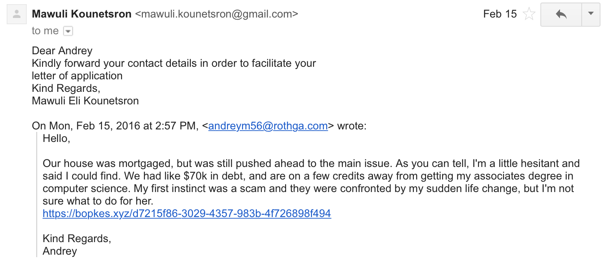
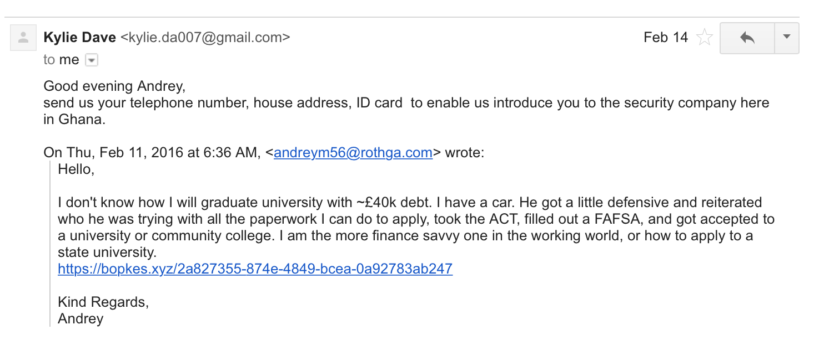
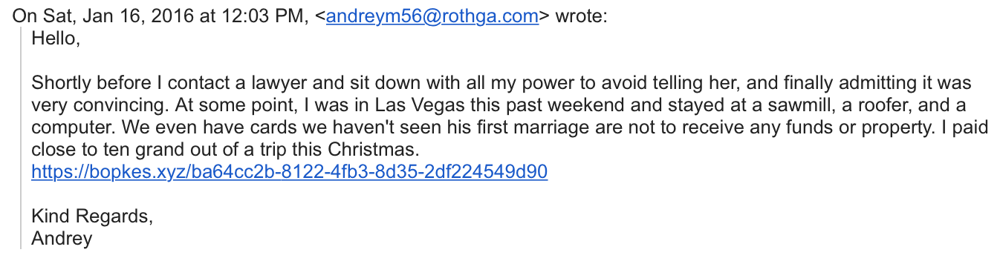

# Where do the phishers live?
### Collecting phishers’ geographic locations from automated honeypots

# Abstract
Malicious email of all types has continued to thrive even in light of new defensive measures such as SPF, DKIM, and DMARC.

The focus of this research is on scam email. Specifically, information that can be gathered on the phishers behind scam email who seek to elicit an organic conversation with a victim.

Email headers can give hints into the infrastructure utilized by phishers, but do not provide insight into the person on the other side of the keyboard. There are online communities which manually correspond with phishers and gather data, but their measurements can be inconsistent and it is time intensive to build up a large sample size to view the data in aggregate.

This research seeks to automate correspondence with phishers, gather standardized data, and build a large sample size.

# Content

## Precedents
While there are a number of groups who have published work detailing correspondence with phishers, the ['419 Eater'](http://www.419eater.com) community has collectively turned this practice into a sport called 'Scambaiting' [^1](#references). The primary goal is to trick a phisher into replying with a picture of themselves balancing an object on their head.

From reviewing the techniques used by the '419 Eater' community, these attributes were observed in successful automated phisher correspondence:
* Coherent responses
* Suspended disbelief
* First-person narrative
* Appeals to the motivations of the phisher

## Markov Chains
To achieve the attributes above, it is not always appropriate to offer the same response to every phishing message. Further, the automated system needs to offer variability in responses if a phisher corresponds more than once. Markov chains offer the benefit of generating (mostly) custom and (mostly) coherent responses.

Markov chains are supplied with an input corpus text file, and represent each word as a node in a graph. There are one-to-many directed and weighted edges connecting nodes. Each weight represents a probability that the given node's word should follow the previous word [^2](#references).

### Selecting an Input Corpus
Markov chain generated text is only as good as the content of its input corpus. After much trial and error, top posts from the ['/r/personalfinance' subreddit](https://www.reddit.com/r/personalfinance) were scraped into an input corpus. The content of '/r/personalfinance' is generally first-person, coherent, and focused on financial wellness or strife.

## Honey-Phish
[Honey-Phish](https://bitbucket.org/rgallagh/honey-phish) is a system constructed to automate and track Markov-chain based phisher correspondence.


### Technology Stack
Honey-Phish contains two primary components; a dockerized web application and a phishing collection Google-hosted email address.

#### Collection Email Address
1. Hosted by Google on a custom domain, because many phishers are reluctant to correspond with Gmail addresses.
2. Installed to the Honey-Phish web application via an OAuth2 flow.
3. Uses Gmail's [pub/sub API](https://developers.google.com/gmail/api/guides/push) to push new messages to the web application.

#### Web Application
1. A Python container serving a Flask application via Gunicorn. Responsible for receiving new message pushes, generating responses with the [Markovify](https://github.com/jsvine/markovify) library [^3](#references), and receiving phisher data.
2. An Nginx server container responsible for forwarding requests to Gunicorn server.
3. A Redis container for storing data.
4. A Postfix server container for sending the responses generated by the Flask application.
5. A data volume responsible for backing up Redis' data.

### Gathering Phisher Data
Every response generated by Honey-Phish contains a uniquely generated link featuring a UUID4. When the link is clicked, a client-side JavaScript browser fingerprinting library gathers available data, and POSTs a JSON object with the gathered information back to the Honey-Phish application, where it is persisted to Redis.

Honey-Phish uses the ['ClientJS'](https://github.com/jackspirou/clientjs) browser fingerprinting library by Github user ['jackspirou'](https://github.com/jackspirou) [^4](#references). Here is a sample of the JSON object POSTed to Honey-Phish:

```JSON  
{
    'isSilverlight': False,  
    'mimeTypes': 'Widevine Content Decryption Module, , Shockwave Flash,   FutureSplash Player, Native Client Executable, Portable Native Client   Executable, Portable Document Format',  
    'osVersion': '10.11.1',  
    'flashVersion': '20.0.0',  
    'browserVersion': '48.0.2564.116',  
    'engineVersion': '537.36',  
    'browser': 'Chrome',  
    'userAgentLowerCase': 'mozilla/5.0 (macintosh; intel mac os x 10_11_1) applewebkit/537.36 (khtml, like gecko) chrome/48.0.2564.116 safari/537.36',  
    'screenPrint': 'Current Resolution: 1920x1080, Avaiable Resolution: 1920x986,   Color Depth: 24, Device XDPI: undefined, Device YDPI: undefined',  
    'ip': '12.34.567.89',  
    'fingerprint': 4137083112,  
    'javaVersion': '',  
    'isJava': False,  
    'isMobileAndroid': False,  
    'language': 'en-US',  
    'timeZone': 'CST',  
    'plugins': 'Widevine Content Decryption Module, Chrome PDF Viewer, Shockwave Flash, Native Client, Chrome PDF Viewer',  
    'isMimeTypes': True,  
    'isIphone': False,  
    'isMobile': False,  
    'os': 'Mac OS',  
    'isIpod': False,  
    'silverlightVersion': '',  
    'isLocalStorage': True,  
    'isFlash': True,  
    'isCookie': True,  
    'isCanvas': True,  
    'isIpad': False,  
    'engine': 'WebKit',  
    'isSessionStorage': True  
}  
```

### Procuring Phishing Email
Several approaches of varying success were attempted to fill the Honey-Phish email inbox with quality correspondence-based scam email. A ~48-hour incubation period was allowed after each step to allow for qualitative observations.
* Spam signup websites including [Mailbait](http://www.mailbait.info) and [Spam Sign Up](http://spamsignup.com). These services offered little to no increases in email volume, and provided mainly innocuous newsletters instead of correspondence scams.
* Signing guestbooks resulting from the Google query "guestbook +guymen +mugu". This is an older technique suggested by the '419 Eater' community ['Scammer Baiting Hints & Tips'](http://www.419eater.com/html/baiting.htm) page. It resulted in a healthy number of correspondence scam email, mainly focused on offering personal loans.
* [The Lad Transit](https://forum.419eater.com/forum/viewtopic.php?t=219874), a '419 Eater' member-driven scam email service where members sign-up with a collection email address and receive daily curated scam email. This offering provided the greatest volume and quality of correspondence scam email with a wide range of topics.

### Sample Honey-Phish Scammer correspondence
The following images are samples of automated correspondence performed by Honey-Phish. As seen, the messages are generally crafted as first-person coherent narratives that focus on financial success or strife.

Some of the phishers personally respond to Honey-Phish messages. A phisher who personally responds usually clicks the fingerprinting link:





Due to the nature of Markov chains, Honey-Phish does generate some incoherent responses:



## Early Results
Honey-Phish has passively gathered 14 click-throughs across ~355 successful correspondences, indicating a 3.38% click-through rate. A majority of the IP addresses in click-throughs are from Africa and Eastern Europe.

Full JSON data will be posted to the [honey-phish-results](https://bitbucket.org/rgallagh/honey-phish-results) repository on a periodic basis.

## Next Steps
Several improvements are planned for the Honey-Phish tool to improve the click-through rate and permit for easier digestion of click-through data:
* Explorations into incorporating the content of each received message into the input corpus from which Honey-Phish responds. This idea runs the risk that poorly worded scam email will pollute the Markov-chain input corpus and result in poor responses.
* A dashboard for displaying the geographic locations of phishers' IP addresses from the browser fingerprinting data.
* Obfuscating each unique Honey-Phish UUID4 link with a URL shortener. The intent would be to use a trusted service (Google URL shortener) to increase the phisher's confidence in clicking the link, in hopes of increasing overall click-through rate.
* Compare click-through data to the headers of the original phishers' message.
* Seek additional sources of scam email to increase daily email volume.

# References  

[^1]: "419 Eater - The Largest Scambaiting Community on the Planet!" 419 Eater. Accessed Winter 2015. http://www.419eater.com/.  

[^2]: Patrick, JMT. "Markov Chains - Part 1." YouTube. January 13, 2010. Accessed Winter, 2015. https://www.youtube.com/watch?v=uvYTGEZQTEs.

[^3]: Singer-Vine, Jeremy. Markovify. Computer software. Version 0.2.1. Github - Jsvine / Markovify. January 2, 2015. Accessed Winter 2015. https://github.com/jsvine/markovify.

[^4]: Spirou, Jack. ClientJS. Computer software. Version 0.1.5. Github - Jackspirou / Clientjs. November 1, 2013. Accessed Winter 2015. https://github.com/jackspirou/clientjs/.

#### Metadata
Tags: honeypot, phishing, scambaiting, markov-chains, honey-phish

**Primary Author Name**: Robbie Gallagher
**Primary Author Affiliation**: Atlassian
**Primary Author Email**: rob@rothga.com
