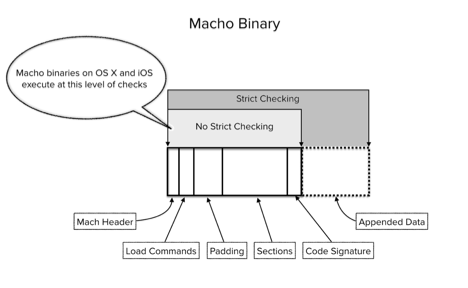
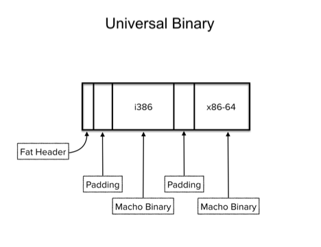

# Hiding from the Investigator: 

#### Understanding OS X and iOS Code Signing to Hide Data

# Abstract
To hide data from a the forensic practitioner you need to exploit either a gap in their knowledge, their processes, and/or their tools. This is a talk about all three in regards to Apple OS X and iOS code signing. Much research has been conducted around code signing with respect to preventing malicious code execution at binary load time. This strictly about forensics, binary tampering, and data smuggling.

# Content

Imagine you are an incident responder for a large organization that is predominantly OS X users that have Admin rights and you allow all connections to the internet with no filtering. When something deemed as an incident happens, you use [OSXCollector](https://github.com/yelp/osxcollector) from Yelp  to collect data from the workstation in question and you just reformat the drive depending on the suspected activity. You look at OSXCollector data and you give any program a pass that comes back as signed by Apple or a reputable developer.  After all, OS X signing is solid. Right?

Well, it depends on how you do your analysis, but OS X signing may not work the way you think it does.


###  Mach-O Binaries

On Windows with the PE file format, if you issue the following command to a signed windows binary, it will no longer be signed:
	
	```
	echo 'No longer signed' >> Some_signed_binary.exe
	```

On OS X and iOS, if you do the same it will still be signed:

	```
	echo "Still signed... sorta" >> some_signed_macho
	```

Try for yourself, on OS X versions prior to El Capitan, do the following:

	```
	# This will not work on El Capitan if SIP is enabled
	sudo echo "Still signed... Sorta" >> /bin/ls

	# This will work on El Capitan - if you have Firefox
	sudo echo "Still signed... Sorta" >> /Applications/Firefox.app/Contents/MacOS/firefox

	#You could do this
	sudo echo 4GB.mov >> /Applications/some.app/Contents/MacOS/firefox

	```

Go ahead and execute the binaries.  You will notice that they both execute. But why? If I issue the following command, codesign will note that they are no longer signed:

	```
	codesign --verify -vv /bin/ls
	codesign --verify -vv /Applications/Firefox.app

	Firefox output:
	codesign --verify -vv /Applications/Firefox.app
	[snip]
	/Applications/Firefox.app: main executable failed strict validation

	```

By default, Mach-O binaries that are part of an application bundle (like Firefox.app) need to either have a valid signature or not be signed at all to execute. Stand alone binaries like /bin/ls do not need to have a valid signature, they will execute either way, by default.  So why did the Firefox.app still execute while not having a valid signature?  Because the operating system does not use strict signature checking for binary execution.  The codesign equivalent is made using the the --no-strict flag.

	```
	codesign --verify -vv --no-strict /bin/ls
	codesign --verify -vv --no-strict /Applications/Firefox.app

	Firefox output:
	codesign --verify -vv --no-strict /Applications/Firefox.app
	[snip]
	/Applications/Firefox.app: valid on disk
	/Applications/Firefox.app: satisfies its Designated Requirement

	```

What's the difference between strict and no-strict checks?




Strict checking involves the entire Mach-O on disk and other resources in the application bundle, if an application.  No strict checking involves from the Mach header to the end of the last section that is mapped into memory via the Load Commands, usually that is the Code Signature section and as of 10.10.4, there could be no sections outside of the Code Signature section.  Since appended data is not mapped into memory via a load command, it goes unchecked. Meaning you can hide data and the OS will not complain by default.

This also works on iOS. Yes, iOS applications are installed with only no-strict checking.
	
	```
	POC:
	1. Transfer purchases from your iPhone to your mac.
	2. Find the ipa of some application.
	3. Unzip the ipa.
	4. Append data: echo secret_photos_stash >> Payload/AppName.app/AppName
	5. Navigate back up to application root
	6. Zip the application to an ipa - include everything that unzipped originally
	7. Delete app from iPhone
	8. Sync purchases or use Xcode to side load the application.
	9. Now that iOS application is smuggling data!
	```

I reported this issue and a resource issue to Apple in April 2015 and was assigned CVE-2015-3714 https://support.apple.com/en-us/HT204942.

```
Available for: OS X Mountain Lion v10.8.5, OS X Mavericks v10.9.5, OS X Yosemite v10.10 to v10.10.3

	Impact: Tampered applications may not be prevented from launching

Description: Apps using custom resource rules may have been susceptible to tampering that would not have invalidated the signature. This issue was addressed with improved resource validation.
```

The most significant change from 10.10.2 to 10.10.4 (the security update patch for Mach-O loading) was the following section of code: 

	```
	/* If we have a code signature attached for this slice
    	* require that the segments are within the signed part
    	* of the file.
    	*/
   	if (result->cs_end_offset &&
   	    result->cs_end_offset < (off_t)scp->fileoff &&
   	    result->cs_end_offset - scp->fileoff < scp->filesize)
   	 {
   	        if (cs_debug)
   	                printf("section outside code signature\n");
   	        return LOAD_BADMACHO;
   	 }
	```

This check, from within the load_segment() function in bsd/kern/mach_loader.c, verifies if a section is outside of the code signature section. It is a great check as one could have modified code outside of the signature on a fully signed application.  As it stands now, apple verifies code that is loaded into memory, so appending code to the end of the binary will not result in direct code execution. And that is a great thing!  Now onto data hiding.

### Universal Binaries

Universal binaries (Fat binaries) are Apple's way of deploying a single binary everywhere so it can execute anywhere on multiple chip architectures.



Notice the padding between Mach-O binaries.  Here is the code from bsd/kern/mach_loader.c, that parses the fat file for Mach-O binaries. 
	
	```
	if (is_fat) {
		/* Look up our architecture in the fat file. */
		error = fatfile_getarch_with_bits(vp, archbits,
		    (vm_offset_t)(&header->fat_header), &fat_arch);
		if (error != LOAD_SUCCESS)
			goto bad2;

		/* Read the Mach-O header out of it */
		error = vn_rdwr(UIO_READ, vp, (caddr_t)&header->mach_header,
		    sizeof (header->mach_header), fat_arch.offset,
		    UIO_SYSSPACE, IO_NODELOCKED, kerncred, &resid, p);
		if (error) {
			error = LOAD_IOERROR;
			goto bad2;
		}

		/* Is this really a Mach-O? */
		if (header->mach_header.magic != MH_MAGIC &&
		    header->mach_header.magic != MH_MAGIC_64) {
			error = LOAD_BADMACHO;
			goto bad2;
		}

		*file_offset = fat_arch.offset;
		*macho_size = fat_arch.size;
	```
	
This code means the data between Mach-O binaries are not checked.  Mach-O binaries are mapped in memory and checked independently, for the architecture that is being executed.  Again there is no direct code execution from patching data into these sections. And the sections can vary in size, but average about 0x1000 bytes. What happens if we insert data in the unprotected sections?  From an execution standpoint, nothing.  After adding a single byte in one unprotected section and using codesign we get an interesting error:
	
	```
	codesign --verify --no-strict -vv ./dmesg
	./dmesg: An internal error has occurred.

	```
Apple was not expecting this.  Using OSXCollector, no error is returned on this.


### Code Execution

The data hiding aspects are now obvious. How can this be abused to get code execution to perhaps add extra functionality to your application?  For iOS, you would need to find a way to create RWX memory to execute foreign code in your application. That and bypass the App Store checks, like [Charlie Miller](http://www.networkworld.com/article/2183007/wireless/apple-bans-researcher-for-app-exposing-ios-security-flaw.html).

On OS X, creating RWX memory is still possible.  There are two scenarios and both involve post exploitation / installation.  The first via post exploitation, an in memory infection scans Mach-O binaries for a magic number in an egg hunter way - once it finds its egg, executes the following payload.  The second, is an App Store application that checks itself on disk for an egg and executes the payload afterwards. A user or an attacker could extend the functionality of the application in this manner. Both POCS are available [here](https://github.com/secretsquirrel/Shmoocon2016).

### Solutions

After talk with Apple Security Engineers in November 2015 about the appending data issue.  They feel that users should use only strict checks to determine if binaries are actually signed and have not been tampered with.  As such, I do not see strict checking by default being pushed info the kernel (beyond gatekeeper) to enforce strict checking at mach-o load time - anytime soon.

#### Introducing Kyphosis

Kyphosis is the medical term for hunchback, because the original thought was you could have a 64KB Mach-O binary with 4GB+ file appended on it.  The goal of kyphosis is to find data that is appended to a Mach-O file or hidden between Mach-O files in a Universal binary - whether the binary is signed or not.  It's a python class and it can be used standalone to pull data from a binary.  It uses Macholib and a Universal binary parser from my side project [BDF](https://github.com/secretsquirrel/the-backdoor-factory).

	```
	Usage: ./kyphosis macho/universal_binary
	#If nothing comes back, you are ok.

	$ ./kyphosis.py dmesg
	Found extra data in the Fat file slack space for dmesg
	Writing to dmesg.extra_data_section0

	$ cat dmesg.extra_data_section0 | hexdump -C
	00000000  00 00 00 00 00 00 00 00  00 00 00 00 00 00 00 00  |................|
	*
	00000b30  41 00 00 00 00 00 00 00  00 00 00 00 00 00 00 00  |A...............|
	00000b40  00 00 00 00 00 00 00 00  00 00 00 00 00 00 00 00  |................|
	*
	00000fd0
	
	$ ./kyphosis.py ./ls
	Found extra data at the end of file ./ls
	Writing to ls.extra_data_end

	$ cat ls.extra_data_end
	Still signed.... sorta
	```

To help the OS X forensic/incident response personnel, I've submitted a pull request (link) to OSXcollector, that will collect this extra data, put it into a dict, base64 encode it, and add it to the dict that OSXcollector uses for data storage.  I've tested this on my own OS X instances, but I don't run a lot of applications. However, I did find one application that kept code outside of Mach-O Load Commands. It's from IDA PRO:
	
	```
	$ ./kyphosis.py /Applications/IDA\ Pro\ 6.8/uninstall.app/Contents/MacOS/osx-intel
	Found extra data at the end of file /Applications/IDA Pro 6.8/uninstall.app/Contents/MacOS/osx-intel
	Writing to osx-intel.extra_data_end
	```
	
And it's a Tcl script:

	```
	00000000   4A 4C 1A 00  00 2D DC AB  80 21 14 AA  1C D9 CE 0A  00 00 6B 00  JL...-...!........k.
	00000014   81 02 28 B2  21 31 CB 53  19 00 00 F8  09 D4 1F 28  05 0D 1C EB  ..(.!1.S.......(....
	00000028   01 AD 23 C8  06 54 03 BB  10 40 05 81  01 6C F1 23  72 9D 1E 0C  ..#..T...@...l.#r...
	0000003C   C6 09 1D 0C  2E 17 AC 0A  23 20 70 0A
	[snip]
	
	```

This application is not signed (all of IDA PRO) and I did not dive into what this script does in particular. Maybe I will at a later date.

In addition, patches were submitted and accepted to Knockknock and OSQuery to do strict checking by default.

Questions and feedback: https://twitter.com/midnite_runr

Happy Hunting!

##### Metadata

Tags: forensics, anti-forensics, Apple, OS X, iOS, codesigning

**Primary Author Name**: Josh Pitts
**Primary Author Affiliation**: N/A
**Primary Author Email**: the.midnite.runr@gmail.com	
